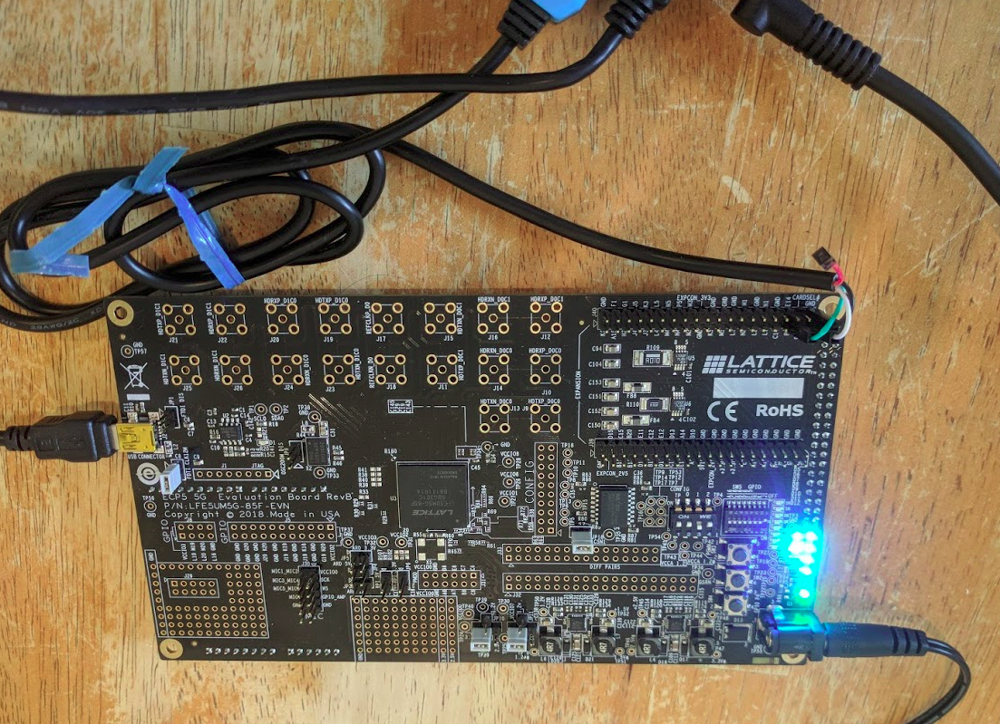
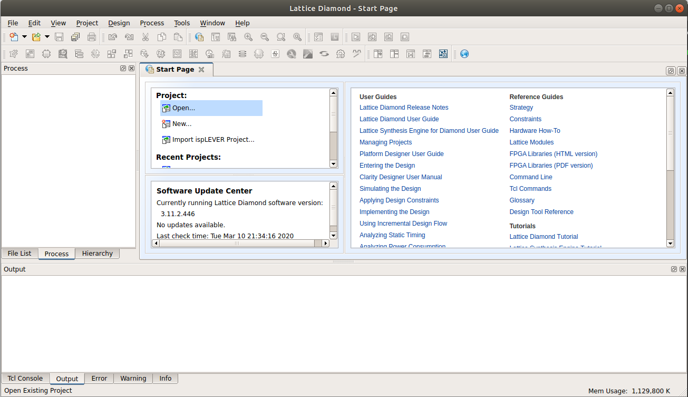
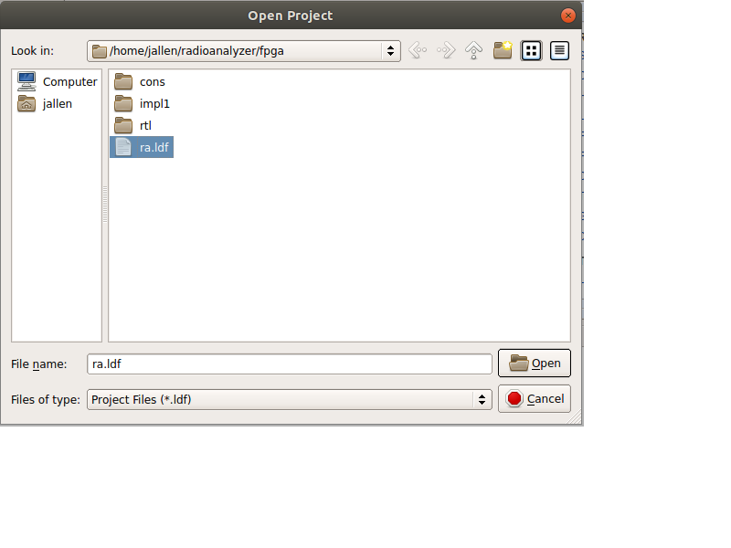
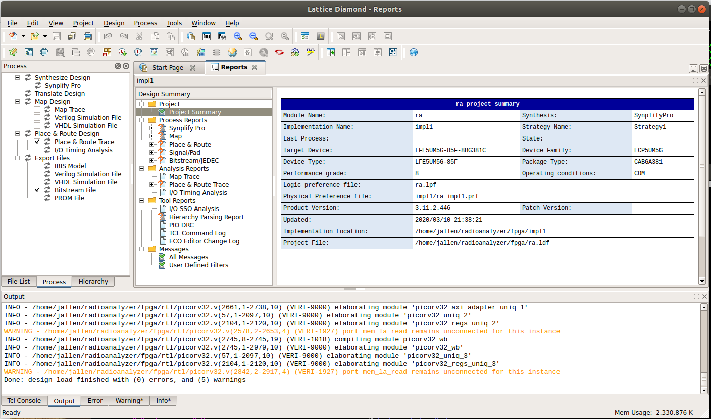
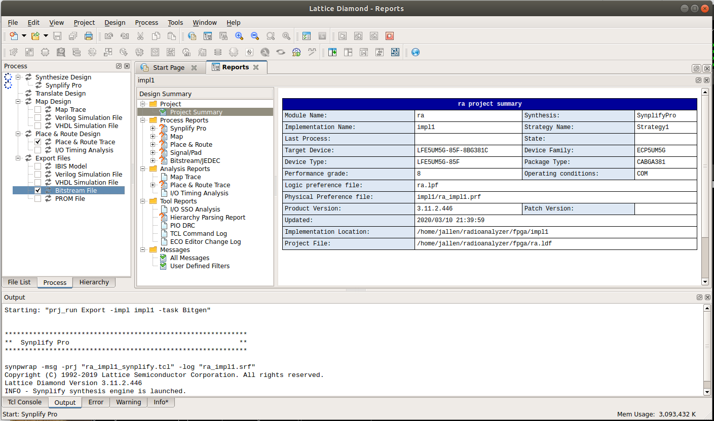
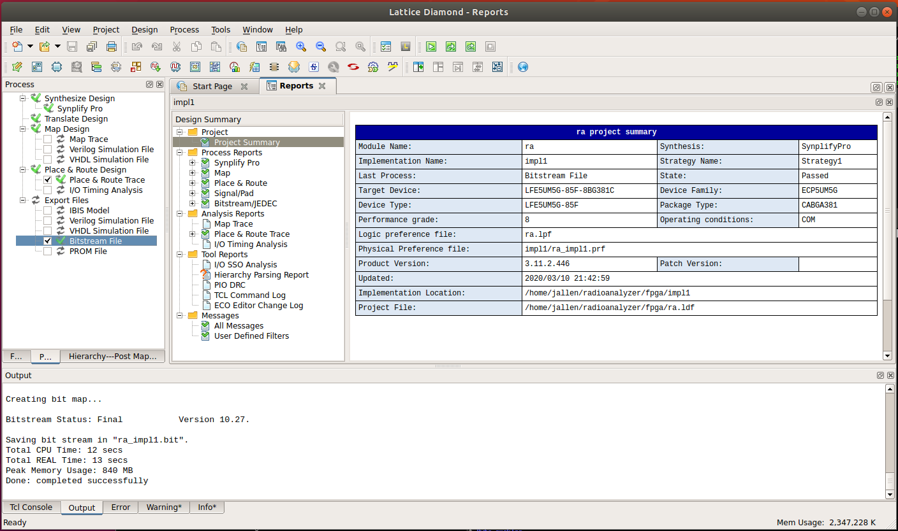
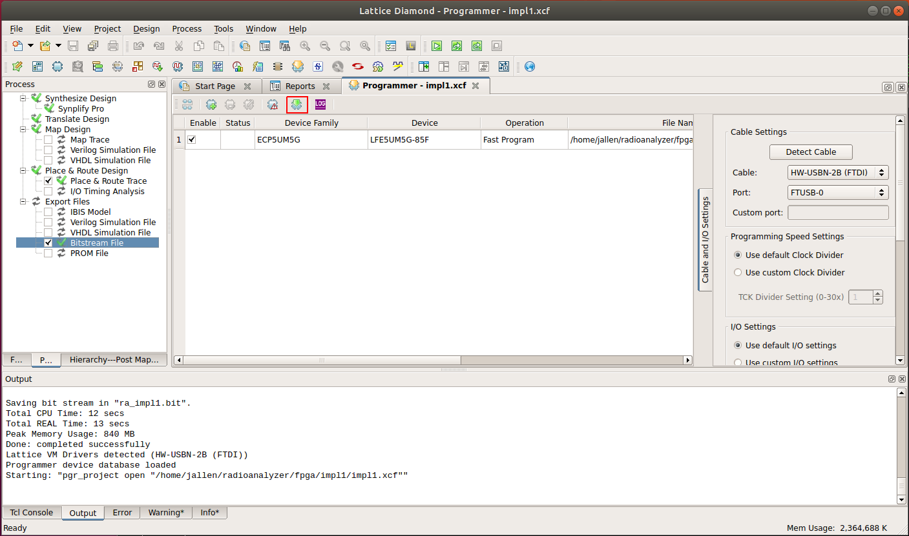
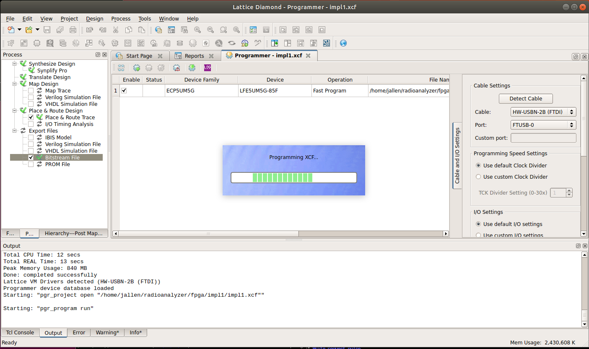

# Radio Analyzer Project

Joe's Antique Radio Analyzer

This is a low cost instrument continaing both a sweep generator and an
oscilloscope.  It is designed primarily to perform alignment on antique
radios.

It is based around a low cost Lattice Semiconductor ECP5 FPGA.  PicoRV32 (a
RISC-V implementation) is used as the soft processor.  An LCD screen and
touch panel user interface are included in the soft SoC made from this
processor.

The signal generator uses a DDS implemented in the FPGA.  An expensive DAC
is avoided by using a delta-sigma modulator enhanced with a digital to time
converter.

The expensive ADCs needed for the oscilloscope are avoided by using an LVDS
input comparator in combination with a time to digital converter.

# Development board

I'm using Lattice's $99 ECP5 evaluation board, which includes a one year
license for Lattice Diamond for the LFE5UM5G-85 FPGA.  This version of the
ECP5 (one which includes high speed serdes) normally requires a subscription
license.  I intend to use the LFE5U FPGA in the final product, which does
not require a subscription license.



# Build Instructions

I use Ubuntu Linux 18.04.

## RISCV toolchain

The picorv32 project has a script to build it, so:

	git clone https://github.com/cliffordwolf/picorv32/tree/v1.0

Follow instructions in README.md file, starting with "make download-tools".

## Lattice Diamond

You need the ECP5 Evaluation Board, you can get one from here:

http://www.latticesemi.com/en/Products/DevelopmentBoardsAndKits/ECP5EvaluationBoard

You can get the Lattice Diamond software from here:

https://www.latticesemi.com/en/Products/DesignSoftwareAndIP/FPGAandLDS/LatticeDiamond

I followed these instructions for installing Diamond on Ubuntu:

https://ycnrg.org/lattice-diamond-on-ubuntu-16-04/

http://timallen.name/index.php/2019/01/14/installing-lattice-diamond-on-ubuntu-18-04/

You will need a license from Lattice.  Your right to it is included with the
purchase of the ECP5 Evaluation Board, but you need to request it from their
web-site.  Once you have the license file, copy it to:

	/usr/local/diamond/3.11_x64/license/license.dat

I tried using LSE at first, but it was crashing with mysterious errors, so I
switched to Synplify.  But I found that the bash shell scripts used to
launch Synplify reference /bin/sh, which is dash on Ubuntu.  Simple solution
is to link /bin/sh to /bin/bash instead of /bin/dash.

## Serial Cable

In Windows I am able to use the extra ports of the FTDI USB to serial
adapter chip for the embedded programmer as a console UART for the FPGA.  In
Linux, all ports of the FTDI chip become disabled, so this can't be done. 
Worse, the Diamond programmer crashes if you have any other FTDI cable
plugged into your computer.  The solution is to use a Prolific or SiLabs
based USB to serial adapter cable for the serial console.

As shown in the photo above, the serial console cable should be connected to
J40:

* K4 is serial ouptut
* P1 is serial input

The baud rate is 115200.  In Linux, I recommend Picocom:

	apt-get install picocom
	sudo picocom --baud 115200 /dev/ttyUSB0

## Software build

	cd sw
	PATH=/opt/riscv32imc/bin:$PATH
	make

This creates "ra.mem" which is currently used to initialize the firmware ROM
within the FPGA.

## FPGA build

Start diamond:

	/usr/local/diamond/3.11_x64/bin/lin64/diamond

You should see:



Click on "open project" and select ra.ldf:



The project should open:



Double-click on "Bitstream File" to build the chip:



Eventually it will finish:



Open the programmer with Tools -> Programmer, and double-click the the
download icon:



The programming should start:



Once the FPGA is programmed, the firmware will start and you should see this
one the serial console:

~~~
Booting..
Press ENTER to continue..

  ____  _          ____         ____
 |  _ \(_) ___ ___/ ___|  ___  / ___|
 | |_) | |/ __/ _ \___ \ / _ \| |
 |  __/| | (_| (_) |__) | (_) | |___
 |_|   |_|\___\___/____/ \___/ \____|

Total memory: 64 KiB

Running memtest ..... passed

SPI State:
  LATENCY 0
  DDR OFF
  QSPI OFF
  CRM OFF


Select an action:

   [1] Read SPI Flash ID
   [2] Read SPI Config Regs
   [3] Switch to default mode
   [4] Switch to Dual I/O mode
   [5] Switch to Quad I/O mode
   [6] Switch to Quad DDR mode
   [7] Toggle continuous read mode
   [9] Run simplistic benchmark
   [0] Benchmark all configs
   [M] Run Memtest
   [S] Print SPI state
   [e] Echo UART

Command> 
~~~ 

# SoC Bus

I use a Verilog source code centered approach to System On Chip (SoC)
design.  This means that instead of using some external tool to generate the
SoC, I design the SoC bus to be very convenient to use from Verilog source
code.  The system is designed right in Verilog, no external tools needed.

Consider a SoC component, such a CSR (Control and Status Register).  It
has:

* Input signals from the bus
* Output signals to the bus
* Bus address

The input signals are gathered into a Verilog bus called "bus_in" (the port
name is "bus_in").  Bus_in includes:

* Address bits
* Write data bits
* Write request pulse
* Byte enables
* Read request pulse
* Clock
* Synchronous reset

The output signals gathered into a Verilog bus called "bus_out" (the port
name is "bus_out").  But_out includes:

* Read acknowledge
* Write acknowledge
* Read data
* Interrupt request

The protocol is very simple.  A transaction is initiated with a single clock
read or write request pulse.  Coincident with this pulse is the address,
write data and byte enables.  These signals are only valid during the pulse.

A transaction is complete when a component returns a single cycle pulse on
read acknowledge or write acknowledge.  Read data is supplied coincident
with the read acknowledge pulse.  At all other times, components must drive
zeros on all bus_out signals.

All of the bus_outs are ORed together and fed back to the bus master.  This
return bus ends up implemented as an OR-tree, which is a very efficient
structure within the FPGA (it's a simple tree of LUTs with no control
signals).  Small components may not drive all of the bus_out signals- they
must drive 0 on any unused signals and the synthesis tool will optimize them
out.

Better synthesis tools support the Verilog "wor" type.  Xilinx XST (part of
ISE) and Altera Quartus both support "wor".  Xilinx Vivado and Synplify
(used by Lattice) unfortunately do not.  If "wor" is supported, all of the
bus_outs can just be connected to the same signal:

```verilog
wire [BUS_IN_SIZE-1:0] bus_in;

wor [BUS_OUT_SIZE-1:0] bus_out;
assign bus_out = 0; // In case no other driver of bus_out...

bus_ram #(.BUS_ADDR(32'h0000_0000), .SIZE(65536)) my_ram
  (
  .bus_in (bus_in),
  .bus_out (bus_out)
  );

bus_rom #(.BUS_ADDR(32'h0001_0000), .SIZE(65536)) my_rom
  (
  .bus_in (bus_in),
  .bus_out (bus_out)
  );

bus_reg #(.BUS_ADDR(32'h0200_0000)) my_gpio
  (
  .bus_in (bus_in),
  .bus_out (bus_out),
  .out (leds)
  );

bus_uart #(.BUS_ADDR(32'h0200_0004)) my_uart
  (
  .bus_in (bus_in),
  .bus_out (bus_out),
  .ser_tx (ser_tx),
  .ser_rx (ser_rx)
  );
````

This is very tidy, since adding a bus component is purely a local editing
operation, meaning that only one part of the source file has to be edited.

If "wor" is not supported, then the bus_outs have to be explicitly ORed,
usually at the end of any module containing bus components:

```verilog
wire [BUS_IN_SIZE-1:0] bus_in;
wire [BUS_OUT_SIZE-1:0] bus_out;

wire [BUS_OUT_SIZE-1:0] bus_out_ram;

bus_ram #(.BUS_ADDR(32'h0000_0000), .SIZE(65536)) my_ram
  (
  .bus_in (bus_in),
  .bus_out (bus_out_ram)
  );

wire [BUS_OUT_SIZE-1:0] bus_out_rom;

bus_rom #(.BUS_ADDR(32'h0001_0000), .SIZE(65536)) my_rom
  (
  .bus_in (bus_in),
  .bus_out (bus_out_rom)
  );

wire [BUS_OUT_SIZE-1:0] bus_out_gpio;

bus_reg #(.BUS_ADDR(32'h0200_0000)) my_gpio
  (
  .bus_in (bus_in),
  .bus_out (bus_out_gpio),

  .out (leds)
  );

wire [BUS_OUT_SIZE-1:0] bus_out_uart;

bus_uart #(.BUS_ADDR(32'h0200_0004)) my_uart
  (
  .bus_in (bus_in),
  .bus_out (bus_out_uart),
  .ser_tx (ser_tx),
  .ser_rx (ser_rx)
  );

// bus_out OR-tree

assign bus_out = bus_out_ram | bus_out_rom | bus_out_uart | bus_out_gpio;
````

Now when you add a componenent, you must edit two locations of the source
file, but this is still not so bad in practice.

Read acknowledge and write acknowledge should be registered outputs: the
fastest components have a one flop delay.  The read and write request pulses
are combinatorial outputs from the CPU (they use the lookahead signals from
the PicoRV32 core).  Back to back single cycle transactions are possible:
the CPU can provide a request pulse within the same cycle that it sees an
acknowledgment pulse.

The protocol is tolerant of extra pipeline delays on bus_in or bus_out.  If
the bus is very large, pipeline flip flops can be inserted anywhere on
bus_in or bus_out to help with timing closure.

On the other hand, only a single transaction can be outstanding on the bus. 
The CPU does not issue a new transaction until the previous one has
been completed.

A timeout mechanism can optionally be implemented to end transactions that
never return an acknowledgment pulse.

The bus can be segmented into different clock domains.  One way is with
asynchronous clock domain crossing FIFOs on bus_in and on bus_out.  The "not
empty" signal from each FIFO should be wired to its "read enable" signal and
should gate the downstream request and upstream acknowledge signals.

The address of each component is specified by a Verilog parameter called
"BUS_ADDR" and the bus size of the component in bytes is specified with a
Verilog parameter called "SIZE".  It is up to each component to decode the
address bus to determine if it should respond to a particular transaction. 
This may seem inefficient, but remember that the synthesis tool is going to
optimize the logic- the address decoders will be combined to save space. 
Furthermore, bus segments can be created by special segmenting modules. 
These modules gate the read and write request pulses so that they only occur
within a specified address range and tie upper address bits to constants. 
Although downstream components decode the entire 32-bit address bus, the
upper bits are constant so the necessary logic is reduced.

All bus component instances are required to have the BUS_ADDR parameter.  This
means it is easy to find the address map by using the UNIX regular
expression search tool "grep":

	grep '\.BUS_ADDR' *.v

Two include files help with declaring bus_in and bus_out.  Bus_params.v
holds parameters which define the size and field positions of bus_in and
bus_out.  Typically the old-style module syntax is used so that bus_params
can be included prior to the first port declaration:

```verilog
module bus_module
  (
  bus_in,
  bus_out
  );

`include "bus_params.h"

input [BUS_IN_WIDTH-1:0] bus_in;
output [BUS_OUT_WIDTH-1:0] bus_out;
````

Bus_decl.v breaks out the fields of bus_in and bus_out into individual
wires.  Bus_params must have been included first:

```verilog
`include "bus_decl.h"
````

This file has:

```verilog
// Declare the internal bus structure
// Break out the structure into wires

wire [BUS_IN_WIDTH-1:0] bus_in;

// No support for wor in Vivado!
//wor [BUS_OUT_WIDTH-1:0] bus_out; // wor used here so that we can have multiple drivers
//assign bus_out = 0; // In case nobody is driving.

wire [BUS_OUT_WIDTH-1:0] bus_out;

// Bus input fields

wire bus_reset_l = bus_in[BUS_FIELD_RESET_L]; // Reset
wire bus_clk = bus_in[BUS_FIELD_CLK]; // Clock

wire [BUS_DATA_WIDTH-1:0] bus_wr_data = bus_in[BUS_WR_DATA_END-1:BUS_WR_DATA_START]; // Write data
wire [BUS_ADDR_WIDTH-1:0] bus_addr = bus_in[BUS_ADDR_END-1:BUS_ADDR_START]; // Address
wire bus_rd_req = bus_in[BUS_FIELD_RE]; // Read request
wire bus_wr_req = bus_in[BUS_FIELD_WE]; // Write request
wire [3:0] bus_be = bus_in[BUS_FIELD_BE+3:BUS_FIELD_BE]; // Byte enables

// Bus output fields

wire bus_irq = bus_out[BUS_FIELD_IRQ]; // Interrupt request
wire bus_wr_ack = bus_out[BUS_FIELD_WR_ACK]; // Write acknowledge
wire bus_rd_ack = bus_out[BUS_FIELD_RD_ACK]; // Read acknowledge
wire [BUS_DATA_WIDTH-1:0] bus_rd_data = bus_out[BUS_RD_DATA_END-1:BUS_RD_DATA_START]; // Read data
````
