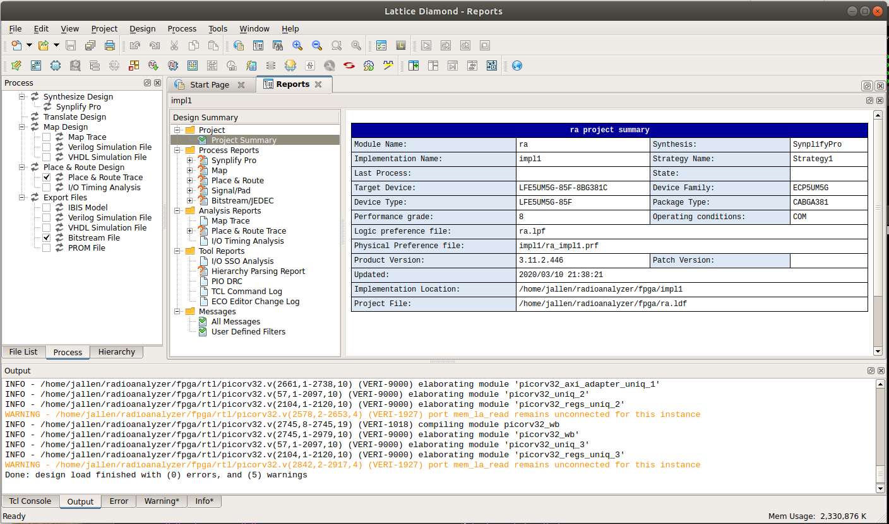
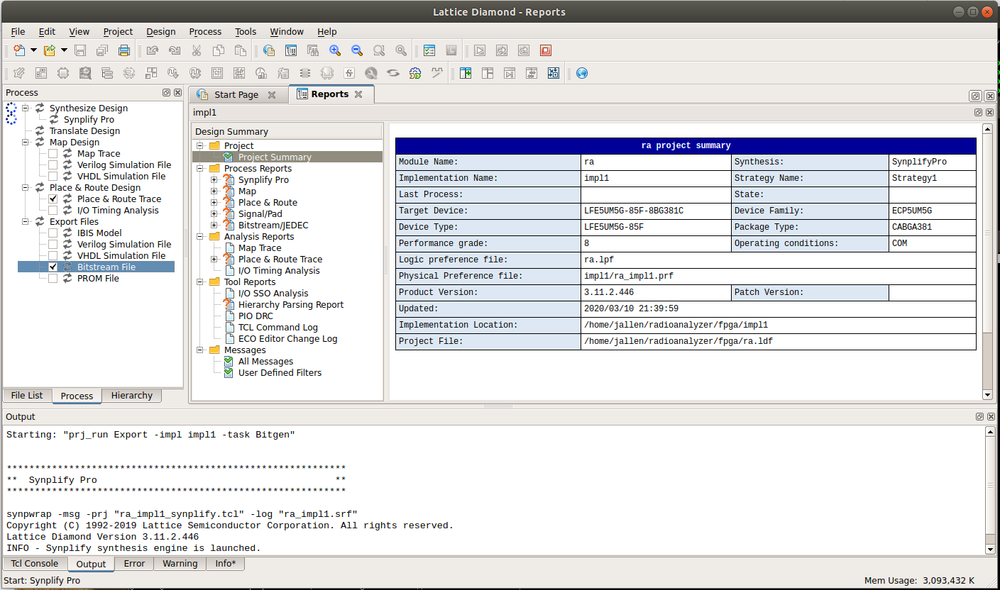
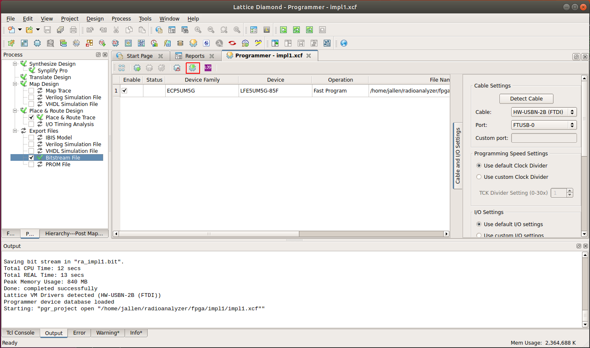

# Build Instructions

I use Ubuntu Linux 18.04.

## Simulation

I use Icarus Verilog for simulation and gtkwave for waveform viewing:

	sudo apt-get install iverilog
	sudo apt-get install gtkwave

## RISCV toolchain

The picorv32 project has a script to build it, so:

	git clone https://github.com/cliffordwolf/picorv32/tree/v1.0

Follow instructions in README.md file, starting with "make download-tools".

## Lattice Diamond

You need the ECP5 Evaluation Board, you can get one from here:

http://www.latticesemi.com/en/Products/DevelopmentBoardsAndKits/ECP5EvaluationBoard

You can get the Lattice Diamond software from here:

https://www.latticesemi.com/en/Products/DesignSoftwareAndIP/FPGAandLDS/LatticeDiamond

It's designed for RedHat, but I followed these instructions for installing
Diamond on Ubuntu:

https://ycnrg.org/lattice-diamond-on-ubuntu-16-04/

http://timallen.name/index.php/2019/01/14/installing-lattice-diamond-on-ubuntu-18-04/

You will need a license from Lattice.  Your right to it is included with the
purchase of the ECP5 Evaluation Board, but you need to request it from their
web-site.  Once you have the license file, copy it to:

	/usr/local/diamond/3.11_x64/license/license.dat

I tried using LSE (Lattice Synthesis Engine) at first, but it was crashing
with mysterious errors, so I switched to Synplify Pro (a high quality logic
synthesis tools included with with Diamond).  But I found that the bash
shell scripts used to launch Synplify reference /bin/sh, which is linked to
"dash" on Ubuntu.  Simple solution is to link /bin/sh to /bin/bash instead
of /bin/dash.

	sudo rm /bin/sh
	sudo ln -s /bin/bash /bin/sh

## Serial Cable

In Windows I am able to use the extra ports of the FTDI FT2232 USB to serial
adapter chip for the embedded programmer as a console UART for the FPGA.  In
Linux, all ports of the FTDI chip become disabled, so this can't be done. 
Worse, the Diamond programmer crashes if you have any other FTDI cable
plugged into your computer.  The solution is to use a Prolific or SiLabs
based USB to serial adapter cable for the serial console.

The serial console cable should be connected to J40:

* K4 is serial ouptut
* P1 is serial input

The baud rate is 115200.  In Linux, I recommend Picocom:

	apt-get install picocom
	sudo picocom --baud 115200 /dev/ttyUSB0

## Software build

	cd sw
	PATH=/opt/riscv32imc/bin:$PATH
	make

This creates "ra.mem" which is currently used to initialize the firmware ROM
within the FPGA.

## FPGA build

Start diamond:

	/usr/local/diamond/3.11_x64/bin/lin64/diamond

You should see:

Click on "open project" and select ra.ldf:

The project should open:

Double-click on "Bitstream File" to build the chip:

Eventually it will finish:

Open the programmer with Tools -> Programmer, and double-click the the
download icon:

The programming should start:

Once the FPGA is programmed, the firmware will start and you should see this
one the serial console:

~~~
Booting..
Press ENTER to continue..

  ____  _          ____         ____
 |  _ \(_) ___ ___/ ___|  ___  / ___|
 | |_) | |/ __/ _ \___ \ / _ \| |
 |  __/| | (_| (_) |__) | (_) | |___
 |_|   |_|\___\___/____/ \___/ \____|

Total memory: 64 KiB

Running memtest ..... passed

SPI State:
  LATENCY 0
  DDR OFF
  QSPI OFF
  CRM OFF

Select an action:

   [1] Read SPI Flash ID
   [2] Read SPI Config Regs
   [3] Switch to default mode
   [4] Switch to Dual I/O mode
   [5] Switch to Quad I/O mode
   [6] Switch to Quad DDR mode
   [7] Toggle continuous read mode
   [9] Run simplistic benchmark
   [0] Benchmark all configs
   [M] Run Memtest
   [S] Print SPI state
   [e] Echo UART

Command> 
~~~ 

You can use the GSRN / SW2 button to reset the firmware.

